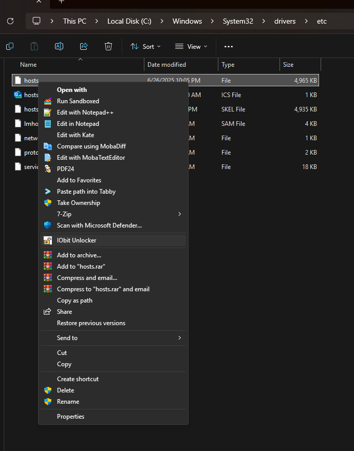

# Update Hosts Windows for Steven Black hosts


- [Update Hosts Windows for Steven Black hosts](#update-hosts-windows-for-steven-black-hosts)
  - [About](#about)
    - [Description](#description)
    - [Motivation](#motivation)
  - [Usage](#usage)
    - [How To Use](#how-to-use)
      - [Enable Powershell Script Execution](#enable-powershell-script-execution)
      - [If The HOSTS File Is In Use](#if-the-hosts-file-is-in-use)
      - [Executing The Script](#executing-the-script)
      - [Parameters](#parameters)
    - [Examples](#examples)
      - [Get Help](#get-help)
      - [Only Download Hosts File](#only-download-hosts-file)
    - [System And Network Hangs And A Solution](#system-and-network-hangs-and-a-solution)
  - [Project Information](#project-information)
    - [Source File Quality](#source-file-quality)
    - [File MD5 Hashes](#file-md5-hashes)
    - [Current Update Hosts Windows PS1 MD5](#current-update-hosts-windows-ps1-md5)
    - [Other Miscellaneous File Information](#other-miscellaneous-file-information)
  - [Note 1](#note-1)
  - [Support Me If You Like](#support-me-if-you-like)
  - [LICENSE](#license)


---

## About

Powershell update/install script for [Steven Black's hosts](https://github.com/StevenBlack/hosts) files for modern Windows (10 and 11, but can be used as far back as 7 if installed).

### Description

This script helps to install or update various hosts files found at ***Steven Black's Hosts*** for use in modern Windows. The preexisting batch script at his repository works for older versions of Windows, but not well nor recommended for modern Windows versions. This script works in nearly the same way as the older batch script except it is written in *Powershell* and adds several features (`-Alternate`, `-Restore`, `-OutFile`, and [more](#parameters)...).

### Motivation

This was born out the necessity for a modern alternative stemming from concerns in this [issue](https://github.com/StevenBlack/hosts/issues/2893#issue-3092991141) at Steven's repository. Not only are there issues with the older batch script method of gaining administrative rights, but *CMD* is no longer recommenced to be used in modern Windows and Powershell natively provides all methods to do all that is needed.

---

## Usage

This is a powershell script and as such is used in the Powershell command line environment. It is backwards compatible with ***Powershell 5.1***<sup>[[1](#note-1)]</sup> as it is pre-installed by default and there's no need to install PowerCore (pwsh, newer versions of PS), though it can be ran from pwsh and it will open in powershell.

### How To Use

#### Enable Powershell Script Execution

Powershell scripts usually can not be executed by default so you must enable it. In any powershell command line type `Set-ExecutionPolicy RemoteSigned -Scope CurrentUser`. If for any reason you want to disable it again type `Set-ExecutionPolicy Restricted -Scope CurrentUser`.

#### If The HOSTS File Is In Use

A major issue with doing anything with the Windows hosts file, especially in modern versions, is that the file is often in use by a different program. 999 out of 1000 times it's usually in use by ***svchost.exe*** which is responsible for the Windows DNS Cache service. This can be interrupted by using and unlocker file program (easiest method), but it only gives a short window of time to edit the hosts file so its best to use a while loop on whatever process/script you're using that keeps it running only if there's an error. You run the while loop and then use a file unlocker on the hosts file which allows the script to be successful in doing it's job and the while loop will discontinue.

For example:

1. Run the while loop to attempt to update the hosts file (from an admin shell):
```Powershell
PS>  while ($LASTEXITCODE -gt 0) { .\updateHostsWindows.ps1 }
```
2. Use an unlocker program ([IoBit Unlocker](https://www.iobit.com/en/iobit-unlocker.php) for example) to unlock the file from use.
On the hosts file: Right Click>Show more options>IoBit Unlocker.



#### Executing The Script

1. Open up any instance of a powershell, pwsh or terminal (Windows Terminal, Tabby, and I guess even cmd.exe for example) that can run Powershell
  (type `powershell` in):
   1. from the *Run* prompt (Win Key+r)
   2. any other command line as mentioned above
   3. from any shortcut you have created that contains `C:\Path\To\powershell.exe -file 'C:\Path\To\updateHostsWindows.ps1'` or similar
2. If powershell is already running you can just execute the script:
   1. If you have placed in a directory in $Env:Path then you can run it from any directory, even without the extension, for example `updateHostsWindows` or `updateHostsWindows.ps1`.
   2. If it's not in a PATH directory you need to know the directory you placed it in and either: `cd C:\Path\To\Script\` and then execute the file `.\updateHostsWindows.ps1` or execute it directly from anywhere by providing the full path: `C:\Path\To\updateHostsWindows.ps1`

#### Parameters

By default this script backs up the current hosts file to *C:\Windows\System32\drivers\etc\hosts.skel* and directly updates the hosts file at `C:\Windows\System32\drivers\etc\hosts`, but a few features/options are provided.

- `-Alterate` allows to install one of the alternate hosts files found in the sub directory *./alternates* at Steven's repository. E.G. `updateHostsWindows -Alternate social`
- `-OutFile` allows you to just download the hosts file to a different location (this skips a backup) instead of installing/updating. E.G. `updateHostsWindows -OutFile 'C:\Path\To\hosts'`
- `-NoBackup` skips a backup altogether.
- `-Force` forces the script to keep running even if there's an error with the creating backup. This is if you really don't care.
- `-Restore` restores the hosts file from a back up skeleton file if it exists and does nothing else.

<details>
<summary>Script Parameter Excerpt</summary>

```Powershell
<#
  .SYNOPSIS
  Install/update hosts files found at https://github.com/StevenBlack/hosts/.
  .DESCRIPTION
  Install/update consolidated hosts files found at
  https://github.com/StevenBlack/hosts/.
  .PARAMETER Alternate
  Update hosts with one of the alternate hosts file found in Steven's alternates
  directory.
  .PARAMETER OutFile
  Download the file only, do not update. Defaults to the current path.
  .PARAMETER NoBackup
  Do not create a backup file.
  .PARAMETER Force
  Force continue the script on errors.
  .PARAMETER Restore
  Restore the hosts file with the current skeleton backup if one exists and
  exits.
  .EXAMPLE
  PS> .\updateHostsWindows.ps1
  .EXAMPLE
  PS> .\updateHostsWindows.ps1 -OutFile '.\hosts'
  --------------------------------------------------------------------------------
  This Powershell script updates the Windows hosts file from one of the various
  consolidated hosts files found at at: https://github.com/StevenBlack/hosts                                              --------------------------------------------------------------------------------
  If updating the hosts file fails due to the hosts file being in use then it's
  best to just keep trying. It's not always in use though it is hard to figure
  out when it's free so it's recommended to use while loop on $LASTEXITCODE to
  keep trying. E.G.: while ($LASTEXITCODE -gt 0) { .\updateHostsWindows.ps1 }.
  --------------------------------------------------------------------------------
  Use: Get-Help .\updateHostsWindows.ps1 -Detailed (or -Full) for more
  information.
  --------------------------------------------------------------------------------

  Checking if we are in a shell with administrative privileges.
  Attempting to get data from
  https://raw.githubusercontent.com/StevenBlack/hosts/refs/heads/master/hosts.
  Attempting to create output file .\hosts.
  Successfully created file: .\hosts.
#>
```

</details>

### Examples

#### Get Help

```Powershell

PS> Get-Help .\updateHostsWindows.ps1 -Full

NAME
    C:\Users\flux\bin\updateHostsWindows.ps1
    
SYNOPSIS
    Install/update hosts files found at https://github.com/StevenBlack/hosts/.
    
    
SYNTAX
    C:\Users\flux\bin\updateHostsWindows.ps1 [[-Alternate] <String>] [[-OutFile] <String>] [-NoBackup] [-Force] [-Restore] [<CommonParameters>]
    
    
DESCRIPTION
    Install/update consolidated hosts files found at
    https://github.com/StevenBlack/hosts/.
    

PARAMETERS
    -Alternate <String>
        Update hosts with one of the alternate hosts file found in Stevens alternates
        directory.
        
        Required?                    false
        Position?                    1
        Default value
        Accept pipeline input?       false
        Aliases
        Accept wildcard characters?  false

    -OutFile <String>
        Download the file only, do not update. Defaults to the current path.

        Required?                    false
        Position?                    2
        Default value
        Accept pipeline input?       false
        Aliases
        Accept wildcard characters?  false

    -NoBackup [<SwitchParameter>]
        Do not create a backup file.

        Required?                    false
        Position?                    named
        Default value                False
        Accept pipeline input?       false
        Aliases
        Accept wildcard characters?  false

    -Force [<SwitchParameter>]
        Force continue the script on errors.

        Required?                    false
        Position?                    named
        Default value                False
        Accept pipeline input?       false
        Aliases
        Accept wildcard characters?  false

    -Restore [<SwitchParameter>]
        Restore the hosts file with the current skeleton backup if one exists and
        exits.

        Required?                    false
        Position?                    named
        Default value                False
        Accept pipeline input?       false
        Aliases
        Accept wildcard characters?  false

    <CommonParameters>
        This cmdlet supports the common parameters: Verbose, Debug,
        ErrorAction, ErrorVariable, WarningAction, WarningVariable,
        OutBuffer, PipelineVariable, and OutVariable. For more information, see
        about_CommonParameters (https://go.microsoft.com/fwlink/?LinkID=113216).

INPUTS

OUTPUTS

    -------------------------- EXAMPLE 1 --------------------------

    PS>.\updateHostsWindows.ps1

    -------------------------- EXAMPLE 2 --------------------------

    PS>.\updateHostsWindows.ps1 -OutFile ".\hosts"
    --------------------------------------------------------------------------------
    This Powershell script updates the Windows hosts file from one of the various
    consolidated hosts files found at at: https://github.com/StevenBlack/hosts
    --------------------------------------------------------------------------------
    If updating the hosts file fails due to the hosts file being in use then its
    best to just keep trying. Its not always in use though it is hard to figure
    out when its free so its recommended to use while loop on $LASTEXITCODE to
    keep trying. E.G.: while ($LASTEXITCODE -gt 0) { .\updateHostsWindows.ps1 }.
    --------------------------------------------------------------------------------
    Use: Get-Help .\updateHostsWindows.ps1 -Detailed (or -Full) for more
    information.
    --------------------------------------------------------------------------------

    Checking if we are in a shell with administrative privileges.
    Attempting to get data from
    https://raw.githubusercontent.com/StevenBlack/hosts/refs/heads/master/hosts.
    Attempting to create output file .\hosts.
    Successfully created file: .\hosts.

    ╔════════════════════════════════════════════════════════════════════════╗
    ║ This Powershell script updates the Windows hosts file from one of the  ║
    ║ various consolidated hosts files found at at:                          ║
    ║ https://github.com/StevenBlack/hosts                                   ║
    ║ This script is written for backwards compatibility for Powershell 5.1+ ║
    ║ as PowerCore is not installed by default.                              ║
    ║                                                                        ║
    ║ Original script written by:                                            ║
    ║ Ian Pride (Lateralus138)                                               ║
    ║ faithnomoread@yahoo.com                                                ║
    ╚════════════════════════════════════════════════════════════════════════╝

    ╔═══════════════════╗
    ║ Parse parameters. ║
    ╚═══════════════════╝

RELATED LINKS

```

#### Only Download Hosts File

```Powershell

PS> Get-Help .\updateHostsWindows.ps1 -OutFile .\hosts

  ...
  ...

  Checking if we are in a shell with administrative privileges.
  Attempting to get data from
  https://raw.githubusercontent.com/StevenBlack/hosts/refs/heads/master/hosts.
  Attempting to create output file .\hosts.
  Successfully created file: .\hosts.

```

### System And Network Hangs And A Solution

An issue with having a large hosts file in Windows is the fact that it seems to stall the internet network. Since many things in modern Windows rely on the internet this can cause problems with the actual system as well. With a small hosts file it's not noticeable, but when you use a custom large one like found at Steven Black's it can stall for a long time. There are 2 solutions, but only one is reasonable and viable:
1. Wait a very, very, very long time and eventually can start to work again (until svchost kicks in again). Not recommended, of course.
2. Compress the hosts file. Technically this is just combining several (up to 9) URLs per IP line which drastically reduces the workload of svchosts and reduces any hang time to 0. I already have a tool to do so here: [Hosts Compress Windows](https://github.com/Lateralus138/hosts-compress-windows).

As with the while loop the updating script you should use the same method with my compression tool:

```Powershell
PS> while ($LASTEXITCODE -gt 0) { .\hostscompress.exe }
```

More information and instructions for using this tool can be found at the link above.

---

## Project Information

This project is written in `Powershell`.

[](https://learn.microsoft.com/en-us/powershell/)

### Source File Quality

This is graded by CodeFactor and is subjective, but helps me to refactor my work.

|Name|Status|
|:---:|:---:|
|[codefactor.io](https://www.codefactor.io/repository/github/lateralus138/updateHostsWindows-stevenblack)||

### File MD5 Hashes

### Current Update Hosts Windows PS1 MD5


### Other Miscellaneous File Information

|Description|Status|
|:---:|:---:|
|Project Release Date||
|Total downloads for this project||
|Complete repository size||
|Commits in last month||
|Commits in last year||


---

## Note 1

Information about Powershell 5.1: [What is Powershell 5.1](https://duckduckgo.com/?q=What+is+Powershell+5.1&ia=web)

Differences between 5.1 and 7+: [Differences between powershell 5.1 and 7](https://duckduckgo.com/?q=differences+between+powershell+5.1+and+7&ia=web)

---

## Support Me If You Like

If this helps you and you care to donate to my ***PayPal***:

[](https://paypal.me/ianapride?locale.x=en_US)


or ***Buy Me A Coffee*** if your prefer:

[](https://www.buymeacoffee.com/ianalanpride)

---


## [LICENSE](./LICENSE)


<details>
  <summary>License Excerpt</summary>
  <br>
  <blockquote>
This program is free software: you can redistribute it and/or modify it under the terms of the GNU General Public License as published by the Free Software Foundation, either version 3 of the License, or (at your option) any later version.
  </blockquote>
  <br>
  <blockquote>
 This program is distributed in the hope that it will be useful, but WITHOUT ANY WARRANTY; without even the implied warranty of MERCHANTABILITY or FITNESS FOR A PARTICULAR PURPOSE.  See the GNU General Public License for more details.
  </blockquote>
</details>